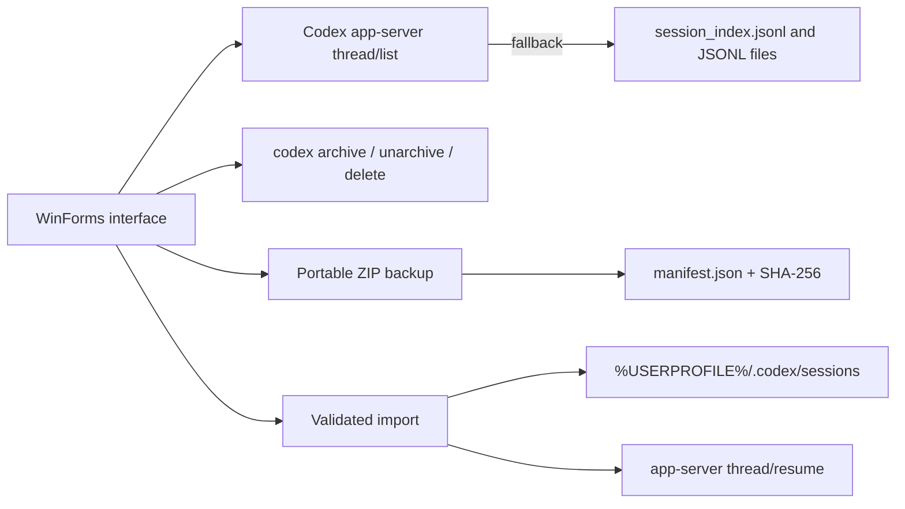

# Codex Chat Manager for Windows

<p align="center">
  
</p>

Codex Chat Manager is a small, local Windows utility for browsing and managing conversations created by the Codex CLI and the Codex extension for Visual Studio Code.

It provides a searchable WinForms interface for listing, archiving, unarchiving, exporting, importing, and permanently deleting selected conversations stored under `%USERPROFILE%\.codex`.

> [!IMPORTANT]
> This is an independent community utility. It is not an official OpenAI product and is not affiliated with or endorsed by OpenAI.

## Features

- Lists active and archived Codex conversations in one searchable table.
- Sorts conversations by most recent activity.
- Supports selecting individual conversations or every visible search result.
- Archives and unarchives conversations through the installed Codex CLI.
- Creates portable `.codexbackup` archives from only the selected conversations.
- Imports portable backups after reinstalling Windows, VS Code, or the Codex extension.
- Preserves conversation UUIDs, titles, timestamps, and raw JSONL history.
- Validates every imported conversation with SHA-256.
- Safely skips UUIDs that already exist on the destination computer.
- Creates an additional local safety copy before permanent deletion.
- Requires two confirmations before deletion, including typing `DELETE` exactly.
- Opens even while VS Code is running and displays a prominent red warning instead of blocking the application.
- Includes a prebuilt x64 executable with no console window.
- Includes a reproducible PS2EXE build script and deterministic PNG/ICO artwork.

## Requirements

For the prebuilt executable:

- Windows 10 or Windows 11, x64.
- The Codex CLI or the Codex VS Code extension installed.
- The Codex extension must have been opened at least once so that `codex.exe` and the local Codex directory are available.

The application searches for `codex.exe` in this order:

1. The current `PATH`.
2. `%USERPROFILE%\.vscode\extensions\openai.chatgpt-*\bin\windows-x86_64\codex.exe`.
3. `%USERPROFILE%\.vscode-insiders\extensions\openai.chatgpt-*\bin\windows-x86_64\codex.exe`.

For building from source, Windows PowerShell 5.1 and the `ps2exe` module are also required.

## Quick start

1. Download `CodexChatManager.exe` from the latest GitHub release.
2. Run `CodexChatManager.exe`.
3. If Windows SmartScreen appears, inspect the file and choose to run it only if it came from a release you trust.
4. Search for conversations and tick the checkbox beside each conversation you want to manage.
5. Choose the required operation.

The executable is self-contained with respect to this repository: it does not need `CodexChatManager.ps1`, `Build-Exe.ps1`, or `Start-CodexChatManager.cmd` at runtime. It still needs the locally installed `codex.exe` and the user's Codex data.

## Interface and operations

### Search and selection

- **Search** filters by conversation title, UUID, or status.
- **Refresh** reloads the catalog from Codex.
- **Select visible** ticks every row currently visible after filtering.
- **Clear selection** unticks every visible row.

Filtering does not modify any data. Only checked rows are passed to an operation.

### Archive selected

Archives checked conversations whose current status is **Active** by running:

```text
codex archive <UUID>
```

### Unarchive selected

Returns checked conversations whose current status is **Archived** to the active catalog by running:

```text
codex unarchive <UUID>
```

### Back up selected

Creates a portable `.codexbackup` or `.zip` archive containing only the checked conversations that have an available JSONL file.

Each portable backup contains:

- The complete raw JSONL history for every selected conversation.
- The original UUID.
- The displayed conversation title.
- The original active or archived status as metadata.
- The latest known activity timestamp.
- A SHA-256 hash for integrity verification.
- A versioned `manifest.json`.

Backups may contain private prompts, responses, paths, commands, and other conversation data. Store them as sensitive files.

### Import backup

Imports a `.codexbackup` or compatible `.zip` created by this application.

During import, the manager:

1. Validates the manifest format and version.
2. Validates each UUID and archive entry path.
3. Refuses unsafe or unexpected file names.
4. Skips conversations whose UUID already exists locally.
5. Extracts each JSONL file through a temporary partial file.
6. Verifies its SHA-256 hash before accepting it.
7. Adds a fallback entry to `session_index.jsonl` when needed.
8. Asks the local Codex app-server to resume and reindex the restored conversation.
9. Restores imported conversations as active conversations.

Restart VS Code after importing if the restored conversations do not appear immediately.

### Delete selected

Permanent deletion is intentionally guarded:

1. The application asks for confirmation.
2. It creates a local safety copy of each available JSONL file under `%USERPROFILE%\.codex\chat-manager-backups`.
3. It requires typing `DELETE` exactly.
4. It runs:

```text
codex delete --force <UUID>
```

The automatic pre-deletion copy is a local emergency copy, not the same as a portable `.codexbackup`. Use **Back up selected** for migration, external storage, or disaster recovery.

## Restoring after reinstalling Windows

Before reinstalling:

1. Open Codex Chat Manager.
2. Select only the conversations you want to preserve.
3. Click **Back up selected…**.
4. Save the `.codexbackup` file to external storage or a trusted cloud provider.
5. Verify that the file exists and has a non-zero size before formatting the computer.

After reinstalling:

1. Install Visual Studio Code.
2. Install and open the Codex extension at least once.
3. Close VS Code for the most predictable import behavior.
4. Run `CodexChatManager.exe`.
5. Click **Import backup…** and select the saved `.codexbackup` file.
6. Wait for integrity verification and reindexing to complete.
7. Restart VS Code and open the full conversation list.

The restored conversation keeps its original UUID and history. The manager does not restore authentication, Codex configuration, project source files, external attachments, or an old project directory that no longer exists.

## Behavior while VS Code is running

The application does not refuse to start when VS Code is open. Instead, it displays a red warning banner and continues to monitor the `Code` and `Code - Insiders` processes every two seconds.

Operations remain enabled, but concurrent access has consequences:

- An actively written conversation may be protected by a file lock.
- The extension may have an older in-memory view of the catalog.
- A successful change may not appear until VS Code restarts.
- An operation may fail safely and report the Codex CLI or file-system error in the log.

For archive, unarchive, import, backup of the currently active thread, and delete operations, closing VS Code first remains the safest workflow.

## How it works



The normal catalog source is the same local Codex app-server protocol used by Codex clients. If the app-server is unavailable or returns an empty catalog while local session files exist, the manager falls back to the legacy index and the `sessions` / `archived_sessions` directories.

Archive, unarchive, and delete actions are performed through commands exposed by the installed Codex CLI. Portable import is the only operation that writes a restored JSONL into the active session directory, after validating its manifest, identity, file name, and hash.

## Codex data locations

By default, the manager uses `%USERPROFILE%\.codex`. If the `CODEX_HOME` environment variable is defined, that directory is used instead.

| Path | Purpose |
|---|---|
| `sessions\YYYY\MM\DD\*.jsonl` | Active raw conversation histories |
| `archived_sessions\*.jsonl` | Archived raw conversation histories |
| `session_index.jsonl` | Legacy/fallback title index |
| `chat-manager-backups\` | Automatic local safety copies made before deletion |
| `state_5.sqlite` and related databases | Internal Codex catalog/state used by current versions |

Internal Codex file names and database versions may change in future Codex releases.

## Portable backup format

A `.codexbackup` file is a standard ZIP archive with a custom extension. Format version 1 uses this structure:

```text
manifest.json
sessions/
  <conversation-uuid>/
    rollout-<timestamp>-<conversation-uuid>.jsonl
```

The manifest has this general shape:

```json
{
  "format": "codex-chat-manager-backup",
  "version": 1,
  "created_at": "2026-08-30T20:00:00.0000000+01:00",
  "conversations": [
    {
      "id": "00000000-0000-0000-0000-000000000000",
      "name": "Example conversation",
      "state": "Active",
      "updated_at": "2026-08-30T19:30:00.0000000+01:00",
      "file": "sessions/00000000-0000-0000-0000-000000000000/rollout-example.jsonl",
      "sha256": "lowercase-sha256-value"
    }
  ]
}
```

Do not manually edit a backup unless you understand the validation rules. A modified JSONL or hash causes the import to fail.

## Running from source

Use the included launcher:

```text
Start-CodexChatManager.cmd
```

Or run the PowerShell script directly:

```powershell
powershell.exe -NoProfile -STA -ExecutionPolicy Bypass -File .\CodexChatManager.ps1
```

The `-STA` option is required for the Windows Forms dialogs.

### List-only diagnostic mode

To print the catalog without opening the graphical interface or changing data:

```powershell
powershell.exe -NoProfile -ExecutionPolicy Bypass -File .\CodexChatManager.ps1 -ListOnly
```

## Building the executable

Install PS2EXE for the current Windows user:

```powershell
[Net.ServicePointManager]::SecurityProtocol = [Net.SecurityProtocolType]::Tls12
Install-Module ps2exe -Scope CurrentUser
```

Then run:

```powershell
powershell.exe -NoProfile -STA -ExecutionPolicy Bypass -File .\Build-Exe.ps1
```

The build script:

- Generates `assets/CodexChatManager.png` at 256×256.
- Generates a compatible 32-bit `assets/CodexChatManager.ico`.
- Compiles `CodexChatManager.ps1` as a Windows x64 GUI executable.
- Embeds the icon and version metadata.
- Disables the console window.
- Writes a lowercase SHA-256 checksum to `CodexChatManager.exe.sha256`.
- Builds to a temporary file and replaces the final EXE only after compilation succeeds.
- Removes incomplete temporary executable files if the build fails.

The current build was tested with PS2EXE `1.0.18` and produces application version `1.2.0.0`.

To set the four-part Windows file version and write the executable to another path:

```powershell
.\Build-Exe.ps1 -OutputPath .\dist\CodexChatManager.exe -Version 1.2.0.0
```

## Repository layout

| File | Description |
|---|---|
| `CodexChatManager.ps1` | Main application and all conversation-management logic |
| `CodexChatManager.exe` | Prebuilt unsigned Windows x64 application |
| `CodexChatManager.exe.sha256` | SHA-256 checksum generated with the executable |
| `Build-Exe.ps1` | Reproducible PS2EXE build and artwork generator |
| `.github/workflows/release.yml` | Tag-driven Windows build and GitHub Release automation |
| `Start-CodexChatManager.cmd` | Development launcher for the PowerShell source |
| `assets/CodexChatManager.png` | Reusable PNG logo for GitHub, documentation, or packaging |
| `assets/CodexChatManager.ico` | Windows icon embedded into the executable |

## Security and privacy

- The manager works with local files and local Codex processes. It does not implement telemetry or upload conversations itself.
- The installed `codex.exe` may use the network according to Codex's own configuration and operation.
- Conversation JSONL and `.codexbackup` files may contain sensitive content. Do not commit them to a public repository.
- Imported backup paths are validated and files are extracted directly to known destinations rather than blindly expanding the ZIP.
- SHA-256 detects accidental or deliberate modification but is not a digital signature and does not prove who created a backup.
- The included EXE is unsigned. SmartScreen and antivirus products may warn about locally generated PS2EXE binaries or report false positives.
- For higher-trust distribution, build from reviewed source and sign the EXE with an Authenticode code-signing certificate.

## Limitations

- Codex's local storage format and app-server protocol are internal implementation details and can change.
- Compatibility with future Codex releases cannot be guaranteed.
- External attachments, generated images, project files, credentials, settings, and plugins are not included in portable backups.
- Restoring a conversation does not recreate its original working directory.
- A conversation currently being written may be locked until VS Code or the relevant Codex process closes.
- Existing UUIDs are skipped rather than overwritten or merged.
- Very large JSONL histories can take time to hash and compress, and the interface may appear busy during that operation.
- The prebuilt application targets Windows x64 only.

## Troubleshooting

| Problem | Suggested action |
|---|---|
| `codex.exe was not found` | Install/open the Codex VS Code extension once, or add the Codex CLI to `PATH`. |
| The list is empty | Click **Refresh**, restart VS Code, and confirm that `%USERPROFILE%\.codex\sessions` contains JSONL files. |
| A conversation has no title | The fallback index may not contain a title; the UUID and history remain usable. |
| An operation fails while VS Code is open | Close every VS Code window, wait for `Code.exe` processes to exit, then retry. |
| Backup fails for the current conversation | Close VS Code or the process writing that conversation so the JSONL lock is released. |
| Imported conversations do not appear | Restart VS Code and use its full conversation list rather than only the compact recent view. |
| Import says the UUID already exists | The local conversation is intentionally preserved; delete it explicitly only if replacement is truly required. |
| Import fails integrity verification | The backup is damaged or was modified. Restore another copy of the original archive. |
| Windows blocks the EXE | Verify the release source and checksum, build from source, or sign the binary for managed distribution. |
| PowerShell refuses to load PS2EXE | Run the documented build command with `-ExecutionPolicy Bypass` or review the machine's execution policy. |

## Publishing a GitHub release

Releases are automated by `.github/workflows/release.yml`. Pushing a version tag starts a clean `windows-latest` runner that installs PS2EXE, derives the Windows file version, builds and verifies the EXE, uploads a workflow artifact, and creates the GitHub Release with generated notes.

Accepted tag formats and their resulting Windows versions:

| Git tag | EXE file version |
|---|---|
| `v1.2` | `1.2.0.0` |
| `v1.2.3` | `1.2.3.0` |
| `v1.2.3.4` | `1.2.3.4` |

The tag is the release version source of truth. Invalid version tags fail before compilation. The workflow has only the `contents: write` permission required to publish release assets.

Recommended release process:

1. Review and test `CodexChatManager.ps1`.
2. Commit and push the final source to `main`.
3. Create and push an annotated tag:

   ```powershell
   git tag -a v1.2 -m "Codex Chat Manager 1.2"
   git push origin v1.2
   ```

4. Follow the **Build and publish Windows release** workflow in the repository's Actions tab.
5. Confirm that the release contains both `CodexChatManager.exe` and `CodexChatManager.exe.sha256`.
6. Download the release asset and test it on Windows.
7. Never attach real `.codexbackup`, JSONL, database, authentication, or configuration files.

If a workflow is rerun for an existing release, its two generated assets are replaced safely with `--clobber` rather than creating a duplicate release.

The PNG logo can be reused for the repository social preview, release artwork, package listings, or future installer branding.

## Contributing

Issues and pull requests are welcome. When reporting a problem, include:

- Windows version.
- Codex CLI version from `codex --version`.
- Whether VS Code was running.
- Whether the conversation was active or archived.
- The relevant application log message with private paths and conversation content removed.

Do not upload private JSONL histories or `.codexbackup` files to public issues.

## License

This project is distributed under the [MIT License](LICENSE). You may use, copy, modify, merge, publish, distribute, sublicense, and sell copies of the software subject to the license terms.
